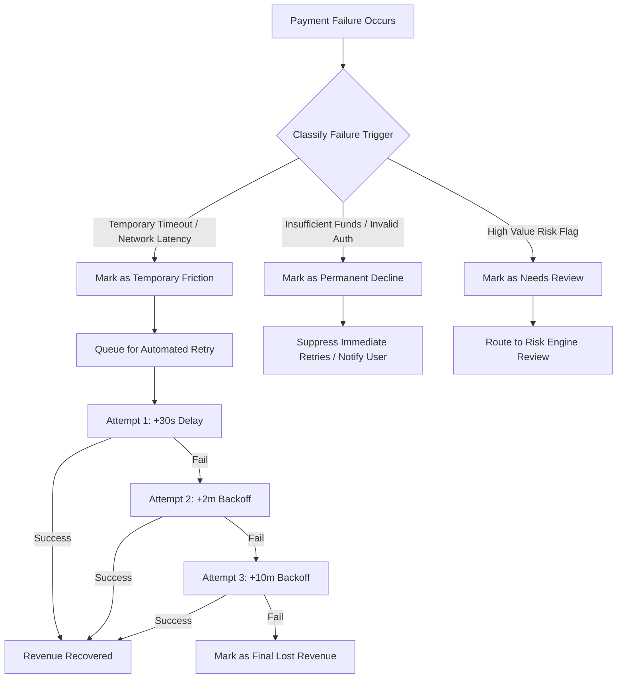

# Payment Failure Classification Framework

This document defines the classification methodology used to distinguish **Temporary Payment Friction** from **Permanently Lost Revenue**. 

---

## Classification Matrix

```text
Response Code / Failure Trigger
             │
             ▼
      Failure Reason
             │
             ▼
   Temporary / Permanent
             │
             ▼
  Recoverable / Non-Recoverable
             │
             ▼
      Business Impact
```

---

## Standardized Failure Classification Table

| Response Code / Trigger | Failure Reason | Temporary / Permanent | Recoverable / Non-Recoverable | Affected Channels / Segments | Business Impact & Action |
| :--- | :--- | :--- | :--- | :--- | :--- |
| `ERR_GATEWAY_TIMEOUT` | Bank server processing timeout / HTTP 504 | **Temporary** | **Recoverable** | Online, QR (Peak Hours: 14:00-18:00) | High monetary impact. Immediate automated retry within 15-30 seconds recovers ~65% of revenue. |
| `ERR_NETWORK_LATENCY` | Mobile network timeout / rural connection drop | **Temporary** | **Recoverable** | Rural Locations (54.34% failure rate) | High volume in Rural areas. Retrying with exponential backoff (60s) yields high recovery. |
| `ERR_BANK_BUSY` | Issuing bank core banking system congestion | **Temporary** | **Recoverable** | AutoPay, Contact, Food & Dining | High friction during meal & bill cycles. Retry after 2-5 minutes avoids user checkout abandonment. |
| `ERR_USER_ABORT_TIMEOUT` | UPI App pin entry delay / session timeout | **Temporary** | **Recoverable** | QR, Shopping, Food & Dining | User friction; trigger push notification and soft retry option on checkout. |
| `ERR_INSUFFICIENT_FUNDS` | Account balance lower than transaction amount | **Permanent** | **Non-Recoverable** | AutoPay (44.92% failure rate), Contact | Hard balance error. Immediate retry fails; schedule smart retry on salary dates (1st/30th). |
| `ERR_INVALID_CREDENTIALS` | Incorrect UPI PIN or expired mandate token | **Permanent** | **Non-Recoverable** | AutoPay, Contact | Hard auth error. Automated retries burn gateway fees. Prompt user to re-authenticate. |
| `ERR_ACCOUNT_CLOSED_BLOCKED` | Bank account frozen, closed, or debit blocked | **Permanent** | **Non-Recoverable** | All Payment Modes | Hard banking block. Suppress retries immediately to avoid API penalty charges. |
| `ERR_FRAUD_RISK_BLOCK` | Risk engine flagged suspicious transaction pattern | **Needs Review** | **Needs Review** | High value transactions (> ₹4,000) | Requires secondary risk check or manual compliance verification before re-attempting. |

---

## Dataset Empirical Classification Breakdown

Based on our empirical analysis of `final_payment_dataset.csv` (250 failed transactions totaling ₹624,002.79):

### 1. Temporary Failures (62.0% of Failures)
* **Count**: 155 transactions
* **Total Exposure**: ₹396,407.36
* **Key Characteristics**: Concentrated in **QR** (64 failures, ₹146,184.53) and **Online** payments (66 failures, ₹181,718.04), particularly in **Food & Dining** (30 failures) and **Online Services** (32 failures).
* **Recovery Outcome**: 102 transactions successfully recovered via 3-stage automated retries, reclaiming **₹260,730.80** (65.81% temporary recovery rate).

### 2. Permanent Failures (38.0% of Failures)
* **Count**: 95 transactions
* **Total Exposure**: ₹227,595.43
* **Key Characteristics**: Concentrated in **AutoPay** (53 failures, ₹132,128.83) and **Contact** payments (67 failures, ₹163,971.39) due to mandate authorization failures and insufficient funds.
* **Recovery Outcome**: Unrecovered. Suppressing retries on these 95 transactions saves ~190 unnecessary gateway API calls.

---

## Decision Logic for Smart Retry Engine


